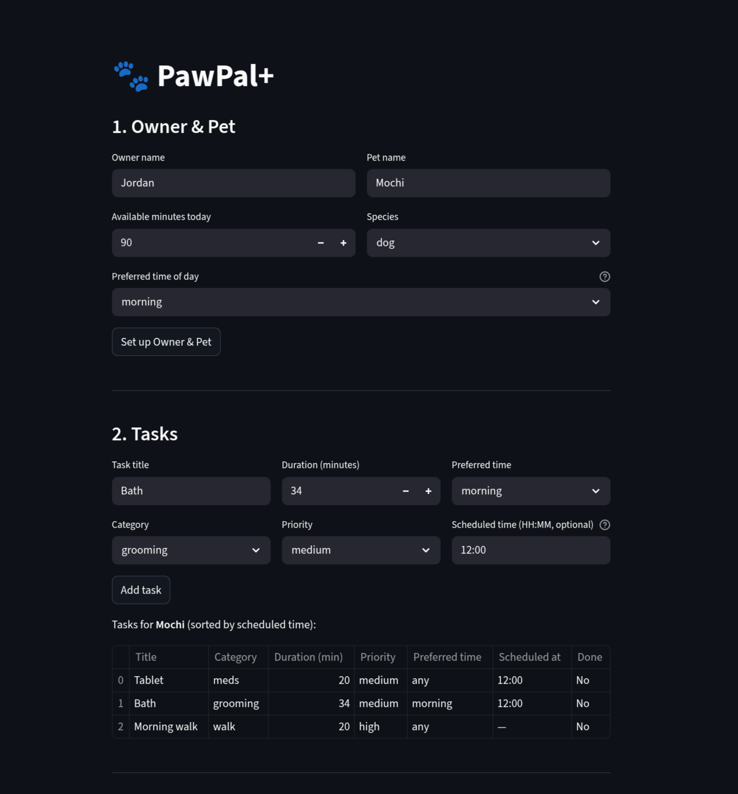
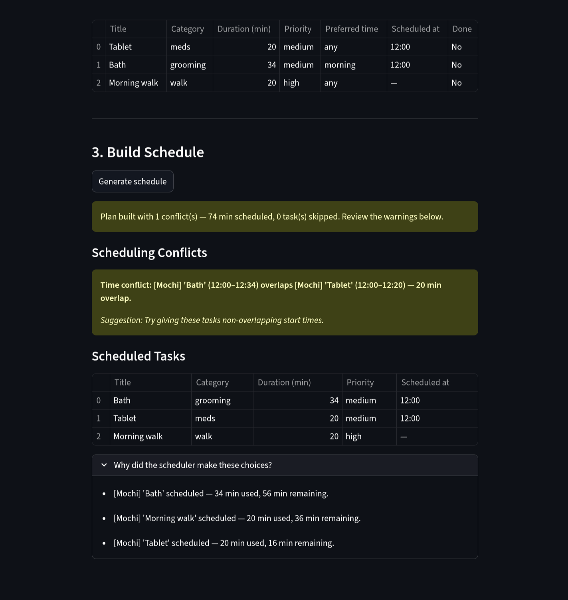

# PawPal+

A Streamlit app that helps busy pet owners plan daily care tasks for their pets.
The scheduler respects time budgets, task priorities, owner preferences, and care-order
rules — and warns you when tasks conflict.

---

## Features

### 1. Multi-tier Task Sorting
Tasks are ranked across three tiers before the daily plan is built:

1. **Time-slot alignment** — tasks whose `preferred_time` matches the owner's `time_of_day` preference (morning / afternoon / evening) are promoted to the top.
2. **Priority** — `high` before `medium` before `low`.
3. **Category order** — `meds → feeding → walk → grooming → enrichment`, so medically important tasks always precede meals and exercise regardless of priority.

### 2. Clock-time Sorting (`sort_by_time`)
Every task can carry an optional `scheduled_time` in `HH:MM` format. `sort_by_time()` converts each time string to total minutes since midnight and returns a new list in ascending clock order. Tasks with no scheduled time are placed at the end using a sentinel value (`9999`). The task list in the UI is always rendered through this sort so the display matches a real daily timeline.

### 3. Greedy Time-budget Scheduling
`Scheduler.build_plan()` iterates through the sorted candidate list and greedily fits each task into the owner's remaining minute budget. Tasks that no longer fit are moved to a **Skipped** list with an explanation. The plan is always returned — a tight schedule never produces an error, only a skipped list.

### 4. Daily and Weekly Recurrence
When a recurring task is marked complete, `Pet.complete_task()` automatically creates the next occurrence with a `due_date` computed via `timedelta`:

| Frequency | Next `due_date` |
|-----------|----------------|
| `daily`   | completed date + 1 day |
| `weekly`  | completed date + 7 days |
| `as_needed` | no next occurrence |

`Task.is_due_today()` compares `due_date` against today's date to decide whether a task should appear as a candidate. A task with no `due_date` (never completed) is always considered due immediately.

### 5. Conflict Detection
After the greedy pass, two independent checks run on the final scheduled list:

| Check | What it catches |
|-------|----------------|
| **Back-to-back** | Two consecutive tasks share a category that should not repeat without a break (e.g. `walk → walk`, `feeding → feeding`). |
| **Ordering violation** | A category that must precede another appears out of order (e.g. `feeding` scheduled before `meds`). |
| **Time-window overlap** | Two tasks with a `scheduled_time` have overlapping intervals, detected with the standard interval test: `start_A < end_B AND start_B < end_A`. |

Conflicts are advisory — the plan is never blocked. Each conflict surfaces in the UI as a `st.warning` banner with a plain-English suggestion for how to fix it.

### 6. Pet and Status Filtering
`Owner.filter_tasks(completed, pet_name)` returns only the tasks that match every supplied filter (AND logic). `Scheduler.build_plan(pet_filter=...)` accepts the same name filter to generate a plan scoped to one pet.

---

## How to Use

1. **Owner & Pet** — Enter an owner name, available minutes for the day, a pet name, species, and preferred time of day. Click **Set up Owner & Pet**.
2. **Tasks** — Add tasks with a title, category, duration, priority, preferred time, and an optional clock time (`HH:MM`). The task list updates in chronological order after every addition.
3. **Build Schedule** — Click **Generate schedule**. The app shows:
   - A summary banner (green if clean, yellow if conflicts exist).
   - Per-conflict warning boxes with actionable suggestions.
   - A table of scheduled tasks sorted by clock time.
   - A table of skipped tasks that didn't fit the time budget.
   - An expandable **Why did the scheduler make these choices?** section with per-task reasoning notes.

---

## Scenario

A busy pet owner needs help staying consistent with pet care. They want an assistant that can:

- Track pet care tasks (walks, feeding, meds, enrichment, grooming, etc.)
- Consider constraints (time available, priority, owner preferences)
- Produce a daily plan and explain why it chose that plan


## Demo





## Getting started

### Setup

```bash
python -m venv .venv
source .venv/bin/activate  # Windows: .venv\Scripts\activate
pip install -r requirements.txt
```

## Smarter Scheduling

The scheduler goes beyond a simple priority sort. Here is what was added and why.

### Multi-tier task sorting
Tasks are sorted across three tiers before any are placed into the plan:
1. **Time-slot alignment** — tasks whose `preferred_time` matches the owner's `time_of_day` preference go first.
2. **Priority** — `high` before `medium` before `low`.
3. **Category order** — `meds → feeding → walk → grooming → enrichment`, so medically important tasks always precede meals and exercise.

### Clock-time sorting
Every task can carry an optional `scheduled_time` in `"HH:MM"` format. `sort_by_time()` converts each string to total minutes since midnight with a lambda key and returns a new list ordered by actual clock time, with un-timed tasks placed at the end.

### Filtering by pet or status
`Owner.filter_tasks(completed, pet_name)` returns only the tasks that match every supplied filter (filters are AND-ed). Useful for showing a single pet's pending tasks or checking what has already been completed.

### Recurring task logic with `timedelta`
When a recurring task is marked complete, `Pet.complete_task()` automatically appends a fresh next occurrence with a computed `due_date`:
- `"daily"` tasks: `due_date = completed_on + timedelta(days=1)`
- `"weekly"` tasks: `due_date = completed_on + timedelta(days=7)`
- `"as_needed"` tasks: no next occurrence is created.

`Task.is_due_today()` then compares `due_date` against today — a single date comparison instead of counting elapsed days.

### Conflict detection
After the greedy pass, two checks run on the final scheduled list:

| Check | What it catches |
|---|---|
| Back-to-back | Two consecutive tasks share a category that should not repeat without a break (e.g. `walk → walk`). |
| Ordering violation | A category that must precede another appears later (e.g. `feeding` before `meds`). |
| Time-window overlap | Two tasks with `scheduled_time` set have overlapping intervals, detected with the standard `start_A < end_B AND start_B < end_A` test. |

All conflicts are returned as warning strings — the plan is never blocked or discarded.


## Testing PawPal+

Run the tests with:

```bash
python -m pytest
```

Confidence Level: 5

### Test classes

| Class	| Tests	| Covers
| --- | --- | ---
| TestSortByTime	| 5	| Chronological order, unscheduled tasks last, no-crash with all-None times, stable sort at equal times, immutability
| TestRecurrenceLogic	| 8	| Daily → +1 day, weekly → +7 days, next occurrence starts incomplete, complete_task appends to pet, as_needed returns None, is_due_today for today/tomorrow/None
| TestConflictDetection	| 6	| Exact same time flagged, overlapping windows flagged, non-overlapping clean, back-to-back walk, feeding-before-meds ordering, conflicts don't block the plan
| TestEdgeCases	| 7	| Pet with no tasks, owner with no pets, task fits exactly in budget, all tasks skipped, get_tasks returns a copy, pet_filter isolates one pet, high priority sorts before low
| Add/Mark Complete test cases | 2 | Adding a task to a pet, marking a task complete and checking next occurrence
